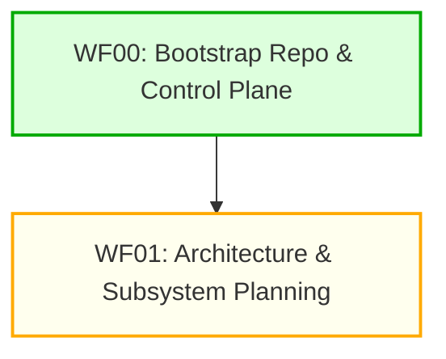

# Task Dependency Graph (task-graph.md)

**Project:** mini-movie-creator-system (MMCS)
**Status:** PENDING — populated by planning workflow

---

## DAG Notation Legend

- `[TaskID]` : A distinct unit of work with a dedicated builder, checker, and locked path ownership.
- `A --> B` : Task B is blocked by and depends directly on Task A completing and passing QC.
- `Wave N` : Parallel execution group; all tasks in Wave N are unblocked once Wave N-1 tasks merge.

---

## Dependency Waves

### Wave 0: Bootstrap (Current)
- `WF00-01`: Control plane directories, state JSON files, 12 root markdown files, baseline report, environment docs.

### Wave 1: Planning (Next)
- `WF01-01`: Comprehensive `spec.md` definition.
- `WF01-02`: DAG construction in `task-graph.md` & `dependencies.json`.
- `WF01-03`: Path ownership assignment in `ownership.md`.
- `WF01-04`: Task population in `todo.md` & `tasks.json`.

*(Full multi-wave execution DAG will be populated by the planning workflow.)*